# 🏗️ Architecture Documentation

## Overview

The Pedagogical Workbook Generator is built using a modern, scalable architecture optimized for Railway deployment. This document details the system design, component interactions, and architectural decisions that enable reliable educational content generation.

## Table of Contents

1. [System Architecture](#system-architecture)
2. [Component Design](#component-design)
3. [Data Flow](#data-flow)
4. [Technology Stack](#technology-stack)
5. [Design Patterns](#design-patterns)
6. [Performance Considerations](#performance-considerations)
7. [Security Architecture](#security-architecture)
8. [Deployment Architecture](#deployment-architecture)

## System Architecture

### High-Level Overview

```mermaid
graph TB
    User[👤 User] --> Browser[🌐 Browser]
    Browser --> NextJS[⚡ Next.js App]
    NextJS --> API[🔌 API Routes]
    API --> AI[🤖 AI Services]
    API --> DB[(📊 Database)]
    Browser --> PDF[📄 PDF Generator]
    
    subgraph "Frontend Layer"
        Browser
        PDF
    end
    
    subgraph "Application Layer"
        NextJS
        API
    end
    
    subgraph "External Services"
        AI
        DB
    end
    
    subgraph "Railway Platform"
        NextJS
        API
        DB
    end
```



### Architectural Principles

1. **Client-Side First**: Critical operations (PDF generation) happen in browser
2. **Serverless Optimization**: Minimal server resources, fast cold starts
3. **Progressive Enhancement**: Graceful degradation when services unavailable
4. **Railway Native**: Designed specifically for Railway's constraints and benefits

## Component Design

### Frontend Architecture

```typescript
// Component Hierarchy
App/
├── Layout/
│   ├── Header
│   ├── Navigation
│   └── Footer
├── Pages/
│   ├── Home
│   ├── Generator/
│   │   ├── WorkbookForm
│   │   ├── WorkbookViewer
│   │   └── ExportOptions
│   └── Library/
│       ├── TemplateGrid
│       └── SavedWorkbooks
└── Components/
    ├── UI/
    │   ├── Button
    │   ├── Form
    │   └── Modal
    └── Features/
        ├── AIContentGenerator
        ├── PDFPreview
        └── ExerciseBuilder
```

#### Component Communication

```typescript
// Data Flow Pattern
interface ComponentProps {
  data: WorkbookData;
  onUpdate: (data: WorkbookData) => void;
  onError: (error: Error) => void;
}

// Event-driven updates
const WorkbookGenerator = () => {
  const [workbook, setWorkbook] = useState<Workbook>();
  
  const handleAIGeneration = useCallback(async (prompt: string) => {
    try {
      const result = await generateWithAI(prompt);
      setWorkbook(result);
    } catch (error) {
      handleError(error);
    }
  }, []);
  
  return (
    <WorkbookViewer 
      workbook={workbook}
      onUpdate={setWorkbook}
      onExportPDF={handlePDFExport}
    />
  );
};
```

### Backend Architecture

```typescript
// API Layer Structure
api/
├── ai/
│   ├── generate-workbook/
│   │   └── route.ts
│   └── generate-content/
│       └── route.ts
├── workbooks/
│   ├── route.ts
│   └── [id]/
│       └── route.ts
├── templates/
│   └── route.ts
├── pdf/
│   └── generate/
│       └── route.ts
└── health/
    └── route.ts
```

#### Service Layer

```typescript
// Service Architecture
services/
├── aiService.ts          // AI provider abstraction
├── workbookService.ts    // Business logic
├── templateService.ts    // Template management
├── simplePdfGenerator.ts // PDF generation
└── validationService.ts  // Data validation

// Example Service
export class WorkbookService {
  constructor(
    private aiService: AIService,
    private database: Database
  ) {}
  
  async generateWorkbook(request: GenerationRequest): Promise<Workbook> {
    // Validate input
    const validation = this.validateRequest(request);
    if (!validation.valid) throw new ValidationError(validation.errors);
    
    // Generate with AI
    const content = await this.aiService.generateContent(request);
    
    // Process and structure
    const workbook = this.structureWorkbook(content);
    
    // Save to database
    return this.database.saveWorkbook(workbook);
  }
}
```

### Data Layer

```typescript
// Data Models
interface Workbook {
  id: string;
  title: string;
  description: string;
  metadata: WorkbookMetadata;
  learningObjectives: LearningObjective[];
  sections: Section[];
  answerKey: AnswerKeyItem[];
  createdAt: Date;
  updatedAt: Date;
}

interface Section {
  id: string;
  title: string;
  conceptExplanation: string;
  examples: Example[];
  exercises: Exercise[];
  order: number;
}

interface Exercise {
  id: string;
  type: ExerciseType;
  question: string;
  options?: string[];
  correctAnswer: string | string[];
  explanation: string;
  difficulty: DifficultyLevel;
  metadata: ExerciseMetadata;
}
```

## Data Flow

### Workbook Generation Flow


### State Management

```typescript
// Global State Architecture
interface AppState {
  workbooks: {
    current: Workbook | null;
    saved: Workbook[];
    templates: Template[];
  };
  ui: {
    loading: boolean;
    errors: Error[];
    modals: ModalState;
  };
  user: {
    preferences: UserPreferences;
    settings: AppSettings;
  };
}

// Context Providers
export const AppProvider = ({ children }: { children: ReactNode }) => {
  const [state, dispatch] = useReducer(appReducer, initialState);
  
  const actions = useMemo(() => ({
    generateWorkbook: (request: GenerationRequest) => 
      dispatch({ type: 'GENERATE_WORKBOOK', payload: request }),
    updateWorkbook: (workbook: Workbook) => 
      dispatch({ type: 'UPDATE_WORKBOOK', payload: workbook }),
    exportPDF: (workbook: Workbook) => 
      dispatch({ type: 'EXPORT_PDF', payload: workbook })
  }), []);
  
  return (
    <AppContext.Provider value={{ state, actions }}>
      {children}
    </AppContext.Provider>
  );
};
```

### PDF Generation Architecture

```typescript
// Client-Side PDF Generation
class PDFArchitecture {
  // Dynamic loading strategy
  static async loadPDFMake() {
    if (typeof window === 'undefined') {
      throw new Error('PDF generation requires browser environment');
    }
    
    // Lazy load dependencies
    const [pdfMake, fonts] = await Promise.all([
      import('pdfmake/build/pdfmake'),
      import('pdfmake/build/vfs_fonts')
    ]);
    
    return this.configurePDFMake(pdfMake, fonts);
  }
  
  // Memory-efficient generation
  static async generatePDF(workbook: Workbook): Promise<Blob> {
    const pdfMake = await this.loadPDFMake();
    
    // Stream generation for large documents
    return new Promise((resolve, reject) => {
      const docDefinition = this.createDocumentDefinition(workbook);
      
      pdfMake.createPdf(docDefinition).getBlob((blob: Blob) => {
        if (blob) resolve(blob);
        else reject(new Error('PDF generation failed'));
      });
    });
  }
}
```

## Technology Stack

### Core Technologies

| Layer | Technology | Version | Purpose |
|-------|------------|---------|---------|
| **Frontend** | Next.js | 15.5.3 | React framework with SSR |
| **Runtime** | Node.js | 18+ | JavaScript runtime |
| **Language** | TypeScript | 5.x | Type-safe development |
| **Styling** | Tailwind CSS | 3.x | Utility-first CSS |
| **PDF** | PDFMake | 0.2.20 | Client-side PDF generation |
| **AI** | OpenAI API | v1 | Content generation |
| **AI** | Anthropic API | v1 | Alternative AI provider |

### Development Tools

| Category | Tool | Purpose |
|----------|------|---------|
| **Build** | Turbopack | Fast development builds |
| **Linting** | ESLint | Code quality |
| **Formatting** | Prettier | Code formatting |
| **Testing** | Jest + RTL | Unit testing |
| **Type Check** | TypeScript | Static analysis |
| **Git Hooks** | Husky | Pre-commit validation |

### Deployment Stack

```yaml
# Railway Configuration
Platform: Railway
Runtime: Node.js 18
Build Tool: npm
Process: next start
Memory: 512MB (scalable)
Storage: Ephemeral
CDN: Railway Edge Network
SSL: Automatic (Let's Encrypt)
Domains: Custom domain support
```

## Design Patterns

### Service Pattern

```typescript
// Abstract service interface
abstract class BaseService {
  protected abstract name: string;
  
  protected async handleError(error: unknown): Promise<never> {
    console.error(`[${this.name}] Error:`, error);
    throw error instanceof Error ? error : new Error('Unknown error');
  }
  
  protected validateInput<T>(data: T, schema: ValidationSchema): T {
    const result = schema.safeParse(data);
    if (!result.success) {
      throw new ValidationError(result.error.issues);
    }
    return result.data;
  }
}

// Concrete implementation
export class AIService extends BaseService {
  protected name = 'AIService';
  
  async generateContent(request: ContentRequest): Promise<Content> {
    try {
      this.validateInput(request, contentRequestSchema);
      
      const provider = this.getProvider(request.provider);
      const response = await provider.generate(request);
      
      return this.processResponse(response);
    } catch (error) {
      return this.handleError(error);
    }
  }
}
```

### Repository Pattern

```typescript
// Data access abstraction
interface WorkbookRepository {
  findById(id: string): Promise<Workbook | null>;
  create(workbook: CreateWorkbookData): Promise<Workbook>;
  update(id: string, data: UpdateWorkbookData): Promise<Workbook>;
  delete(id: string): Promise<void>;
  findByUser(userId: string): Promise<Workbook[]>;
}

// Implementation
export class DatabaseWorkbookRepository implements WorkbookRepository {
  constructor(private db: Database) {}
  
  async findById(id: string): Promise<Workbook | null> {
    const result = await this.db.query(
      'SELECT * FROM workbooks WHERE id = $1',
      [id]
    );
    return result.rows[0] ? this.mapToWorkbook(result.rows[0]) : null;
  }
  
  // ... other methods
}
```

### Factory Pattern

```typescript
// AI Provider Factory
export class AIProviderFactory {
  private static providers = new Map<string, AIProvider>();
  
  static getProvider(type: 'openai' | 'anthropic'): AIProvider {
    if (!this.providers.has(type)) {
      switch (type) {
        case 'openai':
          this.providers.set(type, new OpenAIProvider());
          break;
        case 'anthropic':
          this.providers.set(type, new AnthropicProvider());
          break;
        default:
          throw new Error(`Unknown AI provider: ${type}`);
      }
    }
    
    return this.providers.get(type)!;
  }
}
```

### Observer Pattern

```typescript
// Event system for component communication
export class EventEmitter<T extends Record<string, any>> {
  private listeners = new Map<keyof T, Set<Function>>();
  
  on<K extends keyof T>(event: K, listener: (data: T[K]) => void): void {
    if (!this.listeners.has(event)) {
      this.listeners.set(event, new Set());
    }
    this.listeners.get(event)!.add(listener);
  }
  
  emit<K extends keyof T>(event: K, data: T[K]): void {
    const eventListeners = this.listeners.get(event);
    if (eventListeners) {
      eventListeners.forEach(listener => listener(data));
    }
  }
}

// Usage in components
const workbookEvents = new EventEmitter<{
  generated: Workbook;
  updated: Workbook;
  exported: { workbook: Workbook; format: 'pdf' };
}>();
```

## Performance Considerations

### Frontend Optimization

```typescript
// Code splitting
const WorkbookViewer = lazy(() => import('./WorkbookViewer'));
const PDFGenerator = lazy(() => import('./PDFGenerator'));

// Memoization
const WorkbookSection = memo(({ section, onUpdate }: SectionProps) => {
  const handleUpdate = useCallback((newData: SectionData) => {
    onUpdate(section.id, newData);
  }, [section.id, onUpdate]);
  
  return <Section data={section} onUpdate={handleUpdate} />;
});

// Virtual scrolling for large lists
const VirtualizedWorkbookList = () => {
  return (
    <FixedSizeList
      height={600}
      itemCount={workbooks.length}
      itemSize={120}
    >
      {WorkbookListItem}
    </FixedSizeList>
  );
};
```

### Bundle Optimization

```javascript
// next.config.js
module.exports = {
  experimental: {
    optimizeCss: true,
  },
  
  webpack: (config, { dev, isServer }) => {
    if (!dev && !isServer) {
      // Bundle splitting
      config.optimization.splitChunks = {
        chunks: 'all',
        cacheGroups: {
          ai: {
            name: 'ai',
            test: /[\\/]node_modules[\\/](openai|anthropic)/,
            priority: 30,
          },
          pdf: {
            name: 'pdf',
            test: /[\\/]node_modules[\\/]pdfmake/,
            priority: 25,
          },
        },
      };
    }
    return config;
  },
};
```

### Database Optimization

```typescript
// Connection pooling
const pool = new Pool({
  connectionString: process.env.DATABASE_URL,
  max: 5,
  idleTimeoutMillis: 30000,
  connectionTimeoutMillis: 2000,
});

// Query optimization
export class OptimizedWorkbookRepository {
  async findWithSections(id: string): Promise<WorkbookWithSections | null> {
    // Single query with joins instead of N+1
    const query = `
      SELECT 
        w.*,
        s.id as section_id,
        s.title as section_title,
        s.content as section_content
      FROM workbooks w
      LEFT JOIN sections s ON w.id = s.workbook_id
      WHERE w.id = $1
      ORDER BY s.order ASC
    `;
    
    const result = await pool.query(query, [id]);
    return this.assembleWorkbook(result.rows);
  }
}
```

## Security Architecture

### Input Validation

```typescript
// Zod schemas for validation
export const workbookSchema = z.object({
  title: z.string().min(1).max(200),
  description: z.string().max(1000),
  gradeLevel: z.enum(['elementary', 'middle', 'high']),
  sections: z.array(sectionSchema).max(20),
});

// Sanitization
export const sanitizeInput = (input: string): string => {
  return DOMPurify.sanitize(input, {
    ALLOWED_TAGS: ['b', 'i', 'em', 'strong'],
    ALLOWED_ATTR: []
  });
};
```

### API Security

```typescript
// Rate limiting
export const rateLimiter = {
  windowMs: 15 * 60 * 1000, // 15 minutes
  max: 100, // requests per window
  message: 'Too many requests from this IP',
  standardHeaders: true,
  legacyHeaders: false,
};

// CORS configuration
export const corsOptions = {
  origin: process.env.NODE_ENV === 'production' 
    ? ['https://your-app.railway.app']
    : ['http://localhost:3000'],
  methods: ['GET', 'POST', 'PUT', 'DELETE'],
  allowedHeaders: ['Content-Type', 'Authorization'],
};
```

### Environment Security

```typescript
// Environment validation
const envSchema = z.object({
  NODE_ENV: z.enum(['development', 'production', 'test']),
  DATABASE_URL: z.string().url().optional(),
  OPENAI_API_KEY: z.string().optional(),
  ANTHROPIC_API_KEY: z.string().optional(),
});

export const env = envSchema.parse(process.env);
```

## Deployment Architecture

### Railway-Specific Optimizations

```typescript
// Health check for Railway
export async function GET() {
  const health = {
    status: 'healthy',
    timestamp: new Date().toISOString(),
    uptime: process.uptime(),
    memory: process.memoryUsage(),
    version: process.env.npm_package_version,
  };
  
  return Response.json(health);
}

// Graceful shutdown
process.on('SIGTERM', () => {
  console.log('SIGTERM received, shutting down gracefully');
  server.close(() => {
    process.exit(0);
  });
});
```

### Zero-Downtime Deployment

```yaml
# Railway deployment strategy
strategy:
  type: RollingUpdate
  maxUnavailable: 0
  maxSurge: 1

# Health checks
healthCheck:
  httpGet:
    path: /api/health
    port: 3000
  initialDelaySeconds: 30
  periodSeconds: 10
  timeoutSeconds: 5
  failureThreshold: 3
```

### Monitoring Integration

```typescript
// Application metrics
export class MetricsCollector {
  private static metrics = new Map<string, number>();
  
  static increment(metric: string, value = 1): void {
    const current = this.metrics.get(metric) || 0;
    this.metrics.set(metric, current + value);
  }
  
  static gauge(metric: string, value: number): void {
    this.metrics.set(metric, value);
  }
  
  static getMetrics(): Record<string, number> {
    return Object.fromEntries(this.metrics);
  }
}

// Usage in API routes
export async function POST(request: Request) {
  const startTime = Date.now();
  
  try {
    const result = await processRequest(request);
    MetricsCollector.increment('api.workbook.generate.success');
    return Response.json(result);
  } catch (error) {
    MetricsCollector.increment('api.workbook.generate.error');
    throw error;
  } finally {
    const duration = Date.now() - startTime;
    MetricsCollector.gauge('api.workbook.generate.duration', duration);
  }
}
```

## Architectural Decision Records (ADRs)

### ADR-001: Client-Side PDF Generation

**Status**: Accepted

**Context**: Railway deployment limitations with Puppeteer (300MB+ bundle, memory constraints)

**Decision**: Use PDFMake for client-side PDF generation

**Consequences**:
- ✅ Railway compatibility
- ✅ Reduced server costs
- ✅ Better user experience
- ❌ Limited server-side PDF options
- ❌ Browser dependency for PDF features

### ADR-002: Next.js App Router

**Status**: Accepted

**Context**: Need for modern React features and optimal performance

**Decision**: Use Next.js 15 with App Router

**Consequences**:
- ✅ Better developer experience
- ✅ Improved performance
- ✅ Modern React features
- ❌ Learning curve for team
- ❌ Some community packages not yet compatible

### ADR-003: TypeScript Throughout

**Status**: Accepted

**Context**: Need for type safety and developer productivity

**Decision**: Use TypeScript for all code

**Consequences**:
- ✅ Better code quality
- ✅ Improved IDE support
- ✅ Easier refactoring
- ❌ Initial setup complexity
- ❌ Some third-party type definitions needed

## Future Architecture

### Planned Enhancements

1. **Microservices Transition**
   - Split AI service into separate Railway service
   - Dedicated PDF generation service
   - Shared database layer

2. **Caching Layer**
   - Redis for session storage
   - CDN for static assets
   - Template caching

3. **Real-time Features**
   - WebSocket support for collaborative editing
   - Live preview updates
   - Real-time AI generation status

4. **Advanced Security**
   - JWT authentication
   - Role-based access control
   - API key management

## Conclusion

The architecture prioritizes Railway compatibility while maintaining educational application requirements. Key decisions like client-side PDF generation and serverless optimization ensure reliable deployment and scalable performance.

The modular design allows for future enhancements while maintaining backward compatibility and deployment simplicity. The focus on TypeScript, modern React patterns, and comprehensive error handling provides a solid foundation for educational content generation at scale.