# 🎯 Original Vision & Current Implementation Status

## 📋 Table of Contents
- [Original Vision](#original-vision)
- [System Architecture](#system-architecture)
- [Current Implementation Status](#current-implementation-status)
- [Database Architecture](#database-architecture)
- [Next Development Phases](#next-development-phases)

---

## 🚀 Original Vision

### Vision Statement (Concise)
A web application that:
- **Accepts (almost) any topic** → converts it into a pedagogically sound workbook
- **Generates comprehensive content**: learning objectives, conceptual explanations, visuals, multi-format exercises, formative + summative assessments, answer keys, and optional enrichment
- **Ensures pedagogy quality**: scaffolding, Bloom alignment, differentiation, misconception handling
- **Produces graphically rich output**: illustrations, diagrams, charts
- **Deploys full stack**: frontend + backend services + workers on Railway
- **Uses multiple AI assistants**: GPT-4, Claude Sonnet, orchestration layer
- **Scales across**: subjects, grade levels, locales, and export formats (PDF, web, ePub)

### 🎪 Core Domains (Modular Architecture)

#### 1. **API Gateway / App Server**
- Auth, request shaping, rate limiting, usage metering
- **Status**: ✅ Basic structure in place, ready for auth integration

#### 2. **Topic Interpretation & Curriculum Mapper**
- Classifies topic → subject domain → grade level band → taxonomy tags
- Maps to standards (Common Core, NGSS, etc.)
- **Status**: 🔄 AI service ready, needs curriculum mapping logic

#### 3. **Pedagogical Planner**
- Generates: learning objectives → outline → sequencing strategy
- Enforces Bloom level progression & scaffolding
- **Status**: 🔄 AI generation working, needs pedagogy rule engine

#### 4. **Content Generation Orchestrator**
- State machine pipeline: outline → sections → exercises → solutions → explanations
- Multi-model strategy (Claude for reasoning, GPT for variety)
- **Status**: ✅ Basic AI orchestration, 🔄 State machine needs implementation

#### 5. **Asset Generation Service**
- Image generation (DALL·E / SD)
- Diagram rendering (Mermaid/SVG)
- Equation formatting (MathJax)
- **Status**: 🔄 Ready for implementation, client-side rendering working

#### 6. **Quality & Validation Layer**
- Heuristic + LLM critique + rule-based validators
- Plagiarism screening, readability scoring
- **Status**: 🔄 Framework ready, needs specific validators

#### 7. **Personalization / Adaptation Module**
- Learner models, mastery estimates, adaptive branching
- **Status**: 📋 Future phase, database schema ready

#### 8. **Export & Layout Engine**
- HTML workbook pages, PDF compositor
- Accessibility features
- **Status**: ✅ PDF export working (PDFMake), HTML rendering active

#### 9. **Persistence & Data Layer**
- PostgreSQL (workbook metadata, users, logs)
- Object storage (images, PDFs)
- Vector store (content reuse)
- Redis cache (prompt→response deduplication)
- **Status**: ✅ **FULLY IMPLEMENTED** - All databases connected and operational

#### 10. **Observability & Ops**
- Logging, tracing, metrics (cost, latency, token usage)
- Content generation job dashboard
- **Status**: 🔄 Basic structure, needs monitoring implementation

---

## 🏗️ System Architecture

### High-Level Architecture

```mermaid
graph TB
    User[👤 User] --> Browser[🌐 Browser]
    Browser --> NextJS[⚡ Next.js App]
    NextJS --> API[🔌 API Routes]
    API --> AI[🤖 AI Services]
    API --> DB[(📊 PostgreSQL)]
    API --> Cache[(🔄 Redis)]
    Browser --> PDF[📄 PDF Generator]
    
    subgraph "Frontend Layer"
        Browser
        PDF
    end
    
    subgraph "Application Layer"
        NextJS
        API
    end
    
    subgraph "External Services"
        AI
    end
    
    subgraph "Data Layer"
        DB
        Cache
    end
    
    subgraph "Railway Platform"
        NextJS
        API
        DB
        Cache
    end
```

### Content Generation Pipeline (State Machine)

---

## ✅ Current Implementation Status

### 🟢 **Fully Implemented & Working**
- **✅ Next.js 15 Application**: App Router, Turbopack disabled for stability
- **✅ AI Integration**: OpenAI GPT-4 + Anthropic Claude with fallback logic
- **✅ PDF Export**: Client-side generation with PDFMake (Railway-compatible)
- **✅ Database Layer**: PostgreSQL + Redis fully connected to Railway
- **✅ Schema Design**: Complete Prisma schema with all entities
- **✅ Railway Deployment**: Port configuration, environment variables
- **✅ Development Environment**: Local dev with Railway database connections

### 🟡 **Partially Implemented / Ready for Extension**
- **🔄 Content Generation**: Basic AI service, needs state machine pipeline
- **🔄 Workbook Structure**: Schema defined, generation logic needed
- **🔄 User Management**: Database schema ready, auth implementation needed
- **🔄 Job Queue System**: Redis connected, queue worker needed
- **🔄 Asset Generation**: Framework ready, specific generators needed
- **🔄 Validation Engine**: Basic structure, rule implementation needed

### 🔴 **Not Yet Implemented (Future Phases)**
- **📋 Authentication System**: User registration, login, roles
- **📋 Generation Dashboard**: Real-time progress tracking
- **📋 Standards Alignment**: Curriculum mapping (Common Core, NGSS)
- **📋 Analytics & Monitoring**: Usage tracking, cost analysis
- **📋 Multi-language Support**: Internationalization
- **📋 Advanced Features**: Adaptive learning, personalization

---

## 🗄️ Database Architecture

### **PostgreSQL Schema Overview**
Our Railway PostgreSQL database contains the full schema for the original vision:

#### **Core Entities**
- **`workbooks`**: Main workbook metadata, content, objectives
- **`users`**: Teacher/student/admin accounts with roles
- **`generation_jobs`**: State machine tracking for content generation
- **`generation_steps`**: Individual pipeline step progress and results
- **`assets`**: Generated images, diagrams, charts with metadata
- **`pedagogical_rules`**: Validation rules for educational quality
- **`usage`**: Analytics tracking for costs and performance

#### **Key Features Enabled**
- **Multi-user system**: Teachers can create, students can access
- **Version control**: Workbook creation and modification history
- **Generation tracking**: Full pipeline observability
- **Asset management**: Organized storage of generated content
- **Cost monitoring**: Token usage and expense tracking
- **Quality assurance**: Rule-based pedagogical validation

#### **Redis Cache Architecture**
- **Prompt caching**: Expensive AI generation deduplication
- **Session management**: User authentication state
- **Job queue**: Background processing pipeline
- **Real-time updates**: Generation progress notifications

---

## 📈 Next Development Phases

### **Phase 1: MVP Foundation (2-4 weeks)**
**Goal**: Basic end-to-end workbook generation
- [ ] Implement state machine pipeline (INIT → COMPLETE)
- [ ] Basic user authentication (teacher accounts)
- [ ] Workbook persistence (save/load generated content)
- [ ] Simple generation dashboard
- [ ] Cost tracking and budget enforcement

### **Phase 2: Content Quality (2-3 weeks)**
**Goal**: Pedagogically sound, validated output
- [ ] Pedagogical rule engine implementation
- [ ] Multi-model orchestration (Claude + GPT optimization)
- [ ] Content validation pipeline
- [ ] Misconception detection and remediation
- [ ] Bloom taxonomy enforcement

### **Phase 3: Rich Media (2-3 weeks)**
**Goal**: Visual and interactive content
- [ ] Diagram generation (Mermaid, charts)
- [ ] Image generation integration (DALL-E)
- [ ] Math equation rendering (MathJax)
- [ ] Accessibility features (alt text, ARIA)
- [ ] Enhanced PDF layouts

### **Phase 4: User Experience (2-3 weeks)**
**Goal**: Production-ready teacher tools
- [ ] Advanced workbook editor
- [ ] Student access and progress tracking
- [ ] Sharing and collaboration features
- [ ] Analytics dashboard
- [ ] Usage reporting

### **Phase 5: Scale & Standards (3-4 weeks)**
**Goal**: Multi-subject, standards-aligned system
- [ ] Curriculum standards integration
- [ ] Multi-language support
- [ ] Advanced personalization
- [ ] Marketplace/sharing platform
- [ ] Performance optimization

---

## 🔗 Related Documentation

- [Database Setup Guide](./DATABASE_SETUP.md)
- [Railway Deployment Guide](./docs/RAILWAY_DEPLOYMENT.md)
- [API Documentation](./docs/API_REFERENCE.md)
- [Development Setup](./DEVELOPMENT.md)

---

## 🎯 Key Success Metrics

### **Technical KPIs**
- Generation time per workbook: Target <5 minutes
- Pedagogy compliance score: Target >90%
- Token cost per workbook: Target <$2.00
- System uptime: Target >99%

### **Educational KPIs**
- Teacher adoption rate
- Student engagement metrics
- Learning objective coverage
- Content reuse efficiency

### **Business KPIs**
- Cost per generated workbook
- User retention rates
- Feature utilization
- Scaling efficiency

---

*This document reflects the complete vision and current implementation status as of September 2025. The foundation is solid, databases are connected, and we're ready to build the full pedagogical workbook generation system.*